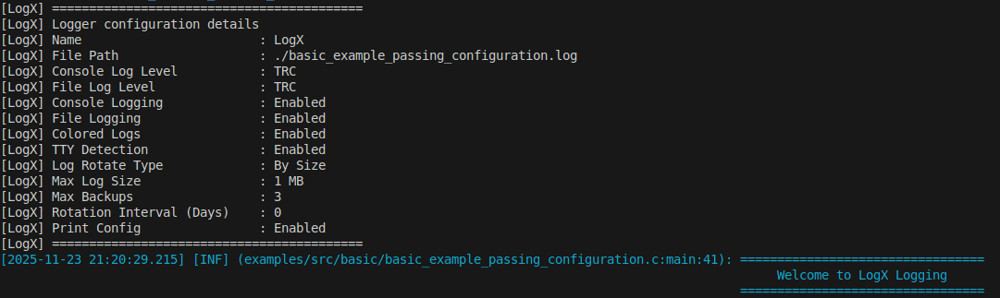
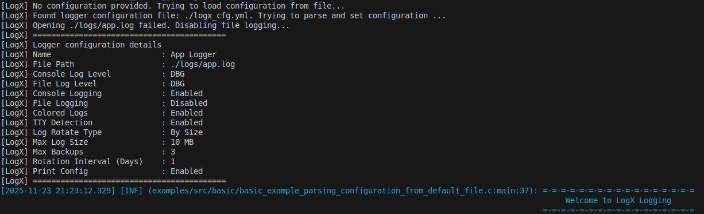
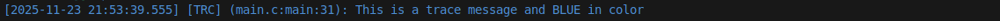
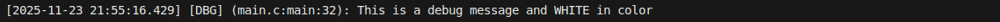
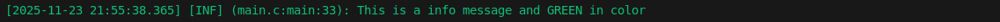
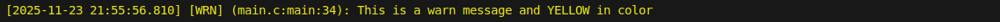
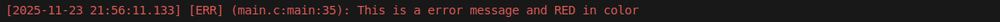
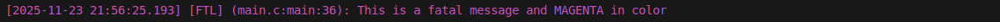
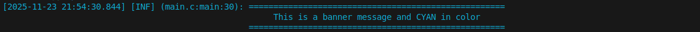
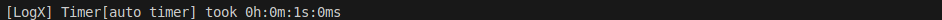

# LogX User Guide

This guide contains easy-to-understand examples explaining how to use each and every features of LogX

## Table of Contents

1. [LogX Integration](#logx-integration)
    - [Understanding LogX configuration](#understanding-logx-configuration)
    - [Default configuration](#logx-integration---default-configuration)
    - [Overriding default configuration](#logx-integration-overriding-default-configuration)
    - [Passing configuration](#logx-integration---passing-configuration)
    - [Parsing configuration from default file](#logx-integration---parsing-configuration-from-custom-file)
    - [Parsing configuration from custom file](#logx-integration---parsing-configuration-from-default-file)

2. [LogX - Log Levels](#logx---log-levels)
    - [Trace](#logx---trace)
    - [Debug](#logx---debug)
    - [Info](#logx---info)
    - [Warn](#logx---warn)
    - [Error](#logx---error)
    - [Fatal](#logx---fatal)
    - [Banner](#logx---banner)

3. [LogX - Log Rotation](#logx---log-rotation)
    - [Rotation based on Size](#logx---rotation-based-on-size)
    - [Rotation based on Date](#logx---rotation-based-on-date)
    - [No Rotation](#logx---no-rotation)

4. [LogX - Timers](#logx---timers)
    - [Simple Timer](#simple-timer)
    - [Pause & Resume](#pause-&-resume)
    - [Auto scope timer](#auto-scope-timer)

5. [LogX - User APIs](#logx---user-apis)
    - [LogX Create](#logx-api---create)
    - [LogX Destroy](#logx-api---destroy)
    - [Enabling/Disabling console logging](#logx-api---enablingdisabling-console-logging)
    - [Setting console log leve](#logx-api---setting-console-log-level)
    - [Enabling/Disabling file logging](#logx-api---enablingdisabling-file-logging)
    - [Setting file log level](#logx-api---setting-file-log-level)
    - [Enabling/Disabling colored logging](#logx-api---enablingdisabling-colored-logging)
    - [Enabling/Disabling TTY detection](#logx-api---enablingdisabling-tty-detectiona)
    - [Setting log rotate type](#logx-api---setting-log-rotate-type)
    - [Forcing a log rotation](#logx-api---forcing-a-log-rotation)
    - [Setting maximum size of logfile](#logx-api---setting-max-size-of-log-files)
    - [Setting number of logfile backups](#logx-api---setting-number-of-logfile-backups)
    - [Enabling/Disabling print config](#logx-api---enablingdisabling-print-config)

    

## Logx Integration

### Understanding LogX Configuration

- LogX uses the following configuration structure the let's you fine-tune the logging needs for your application.

```c
typedef struct
{
    const char       *name;                   /* Name for the logger instance - just for identification purpose */
    const char       *file_path;              /* Logfile path */
    logx_level_t      console_level;          /* level threshold for console logging */
    logx_level_t      file_level;             /* level threshold for file logging */
    int               enable_console_logging; /* Enable / Disable console logging */
    int               enable_file_logging;    /* Enable / Disable file logging */
    int               enable_colored_logs;   /* Enable / Disable ANSI colored logs (Only visible in console logs) */
    int               use_tty_detection;      /* Auto Enable / Disable colored logs based on TTY detection */
    logx_rotate_cfg_t rotate;                 /* Control Log Rotation */
    const char       *banner_pattern;         /* Configure Banner Pattern (Used in LOGX_BANNER() */
    int               print_config;           /* Enable / Disable verbose print of LogX configuration that's chosen */
} logx_cfg_t;
```
---

### LogX Integration - Default Configuration

- When `logx_create()` is called with NULL, LogX will try to look for configuration information in the following order until success:
    1. If `LOGX_CFG_FILE_PATH` MACRO is declared, tries to fetch configuration settings from that file.
    2. Looks for `./logx_cfg.yml`, `./logx_cfg.yaml` or `./logx_cfg.json` (in the same order)
    3. Sets Default configuration.

```C
#include <stdio.h>
#include <logx/logx.h>

int main() {
    // Initialize logger
    logx_t *logger = logx_create(NULL); // passing NULL to use default configuration
    if(!logger)
    {
      fprintf(stderr, "Failed to create logx logger instance\n");
      return -1;
    }

    LOGX_DEBUG(logger, "This is a debug message");
    
    // Destroy logger to clean up resources
    logx_destroy(logger);
    return 0;
}
```

### Output:


---

### LogX Integration - Overriding Default Configuration

- LogX provides you the flexibility to override the default logger configurations defined in the [include/logx/logx_defaults.h](https://github.com/Kulasekaran-148/LogX/blob/main/include/logx/logx_defaults.h)

```c
#define LOGX_DEFAULT_CFG_NAME                       "LogX_Default"
#define LOGX_DEFAULT_CFG_LOGFILE_PATH               "./logx.log"
#define LOGX_DEFAULT_CFG_CONSOLE_LEVEL              LOGX_LEVEL_TRACE
#define LOGX_DEFAULT_CFG_FILE_LEVEL                 LOGX_LEVEL_TRACE
#define LOGX_DEFAULT_CFG_ENABLE_CONSOLE_LOGGING     true
#define LOGX_DEFAULT_CFG_ENABLE_FILE_LOGGING        true
#define LOGX_DEFAULT_CFG_ENABLE_COLORED_LOGGING     true
#define LOGX_DEFAULT_CFG_ENABLE_TTY_DETECTION       true
#define LOGX_DEFAULT_CFG_LOG_ROTATE_TYPE            LOGX_ROTATE_BY_SIZE
#define LOGX_DEFAULT_CFG_LOG_ROTATE_SIZE_MB         10
#define LOGX_DEFAULT_CFG_LOG_ROTATE_MAX_NUM_BACKUPS 3
#define LOGX_DEFAULT_CFG_LOG_ROTATE_DAILY_INTERVAL  1
#define LOGX_DEFAULT_CFG_BANNER_PATTERN             "="
#define LOGX_DEFAULT_CFG_PRINT_CONFIG               true
```

- All the abvoe MACROS are guarded with `#ifndef` which allows you to override them from your project code.
- Only thing you need to do is to make sure you declare the MACRO you want to change before the line `#include <logx/logx.h>`.

### LogX Integration - Passing configuration

```c
#include <logx/logx.h>
#include <stdio.h>

int main()
{
    logx_t    *logger;
    logx_cfg_t cfg = {0};

    /* Logger Configuration */
    cfg.name                   = "LogX";
    cfg.enable_console_logging = 1;
    cfg.enable_file_logging    = 1;
    cfg.file_path              = "./basic_example_passing_configuration.log";
    cfg.enable_colored_logs   = 1;
    cfg.use_tty_detection      = 1;
    cfg.console_level          = LOGX_LEVEL_TRACE;
    cfg.file_level             = LOGX_LEVEL_TRACE;
    cfg.rotate.type            = LOGX_ROTATE_BY_SIZE;
    cfg.rotate.size_mb       = 1024 * 1024 * 1; /* 1 MB */
    cfg.rotate.max_backups     = 3;
    cfg.print_config           = 1;

    logger = logx_create(&cfg);
    if (!logger)
    {
        fprintf(stderr, "Failed to create logger instance\n");
        return -1;
    }
    LOGX_BANNER(logger, "Welcome to LogX Logging");
    logx_destroy(logger);
    return 0;
}
```

### Output:



---

### LogX Integration - Parsing configuration from default file

- When `logx_create()` is called with NULL, LogX will try to look for configuration information in the following order until success:
    1. If `LOGX_CFG_FILE_PATH` MACRO is declared, tries to fetch information from that file.
    2. Looks for `./logx_cfg.yml`, `./logx_cfg.yaml` or `./logx_cfg.json` (in the same order)
    3. Sets Default configuration.

```c
#include <logx/logx.h>
#include <stdio.h>

int main()
{
    logx_t *logger = logx_create(NULL);
    if (!logger)
    {
        fprintf(stderr, "Failed to create logger instance\n");
        return -1;
    }
    LOGX_BANNER(logger, "Welcome to LogX Logging");
    logx_destroy(logger);
    return 0;
}
```

### Output:



---

### LogX Integration - Parsing configuration from custom file

- When `logx_create()` is called with NULL, LogX will try to look for configuration information in the following order until success:
    1. If `LOGX_CFG_FILE_PATH` MACRO is declared, tries to fetch information from that file.
    2. Looks for `./logx_cfg.yml`, `./logx_cfg.yaml` or `./logx_cfg.json` (in the same order)
    3. Sets Default configuration.

```c
#include <logx/logx.h>
#include <stdio.h>

#define LOGX_CFG_FILE_PATH "./some_file_path" // file must be a valid YAML/JSON

int main()
{
    logx_t *logger = logx_create(NULL);
    if (!logger)
    {
        fprintf(stderr, "Failed to create logger instance\n");
        return -1;
    }
    LOGX_BANNER(logger, "Welcome to LogX Logging");
    logx_destroy(logger);
    return 0;
}
```

---

## LogX - Log Levels

- LogX provides the following log levels
    - `TRACE` - Useful when debugging the flow of the program
    - `DEBUG` - Useful for logging information that is for developers-only
    - `INFO` - Useful for logging information that is necessary for non-developers, perhaps during testing
    - `WARN` - Useful for logging failures that do not affect functionality, but still need to be aware of
    - `ERROR` - Useful for logging errors
    - `FATAL` - Useful for logging critical failures in the code, due to which the program will need to terminate
    - `BANNER` - Useful for logging specific milestones during runtime. (E.g. "Starting Firmware update...")

```c
/* Log levels */
typedef enum
{
    LOGX_LEVEL_TRACE = 0,
    LOGX_LEVEL_DEBUG,
    LOGX_LEVEL_BANNER,
    LOGX_LEVEL_INFO,
    LOGX_LEVEL_WARN,
    LOGX_LEVEL_ERROR,
    LOGX_LEVEL_FATAL,
    LOGX_LEVEL_OFF
} logx_level_t;
```

### LogX - Trace

```c
LOGX_TRACE(logger, "This is a trace message and BLUE in color");
```



### LogX - Debug

```c
LOGX_DEBUG(logger, "This is a debug message and WHITE in color");
```



### LogX - Info

```c
LOGX_INFO(logger, "This is a info message and GREEN in color");
```



### LogX - Warn

```c
LOGX_WARN(logger, "This is a warn message and YELLOW in color");
```



### LogX - Error

```c
LOGX_ERROR(logger, "This is a error message and RED in color");
```



### LogX - Fatal

```c
LOGX_FATAL(logger, "This is a fatal message and MAGENTA in color");
```



### LogX - Banner

```c
LOGX_BANNER(logger, "This is a banner message and CYAN in color");
```

- If you notice, there is one thing specially crafted about `LOGX_BANNER`, can you guess what it is 👀 ?



- Banner messages are **auto-centered** inside the banner, making it look aesthetically more beautiful ✨

---

## LogX - Log Rotation

- LogX comes in handy with log rotation feature, so that you don't need to worry about your log file(s) filling up the space
- LogX let's you control the rotation of log files based on `SIZE` or `DATE`. Check out [Setting log rotate type](#logx-api---setting-log-rotate-type)
- LogX also let's you control the number of backups to be maintained. Check out [Setting number of logfile backups](#logx-api---setting-number-of-logfile-backups)

```c
typedef struct
{
    logx_rotate_type_t type;            /* type of rotation */
    size_t             size_mb;       /* used when tyep == LOGX_ROTATE_BY_SIZE */
    int                max_backups;     /* number of backup files to keep (0 = no backups) */
    int                daily_interval;  /* days between rotations when type = LOGX_ROTATE_BY_DATE (1 = daily) */
} logx_rotate_cfg_t;
```

**Log Rotation Types:**

```c
typedef enum
{
    LOGX_ROTATE_NONE = 0,
    LOGX_ROTATE_BY_SIZE,
    LOGX_ROTATE_BY_DATE
} logx_rotate_type_t;
```

---

### LogX - Rotation based on size

During configuration, you can use `cfg.rotate.type` to set it based on size and specify the size in mb using `cfg.rotate.size_mb`

```c
cfg.rotate.type = LOGX_ROTATE_BY_SIZE;
cfg.rotate.size_mb = 10;    // Log rotation happens if file size exceeds 10mb
cfg.rotate.max_backups = 5; // Number of backups to maintain
```

- For example, consider your log file is `example.log`.
- When logfile exceeds the size, it gets renamed as `example.log` --> `example.log.1`
- Again when size exceeds, `example.log.1` --> `example.log.2`
- This continues until `cfg.rotate.max_backups` number of log files are present. Now, when size exceeds again, the oldest of the log file gets deleted.

---

### LogX - Rotation based on date

During `logx_create`, LogX will save the current date in its configuration. Using this information, the LOGX_ROTATE_BY_DATE works.

- You can use `cfg.rotate.daily_interval` to specify how many number of days once the log file needs to be rotated.

```c
cfg.rotate.type = LOGX_ROTATE_BY_DATE;
cfg.rotate.daily_interval = 1 // Rotate the log files daily
cfg.rotate.max_backups = 5    // Number of backups to maintain
```

- With rotation by date, number of backups mean, the number of days after which the oldest log files will start getting deleted.

---

### LogX - No rotation

- If you don't want LogX to take care of rotation at all, just specify `cfg.rotate.type = LOGX_ROTATE_NONE`
- When the above is set, none of the rotation configuration matters

---

## LogX - Timers

### Simple Timer

```c
// start the timer
logx_timer_start(logger, "timer name");

// do some work for 1s
sleep(1);

// stop the timer
logx_timer_stop(logger, "timer name");
```

---

### Pause & Resume

```c
// start the timer
logx_timer_start(logger, "pause_resume_timer");

// do some work for 1s
sleep(1);

// pause the timer
logx_timer_pause(logger, "pause_resume_timer");

// do some work for 1s
sleep(2);

// resume the timer
logx_timer_resume(logger, "pause_resume_timer");

// do some work for 1s
sleep(1);

// stop the timer
logx_timer_stop(logger, "pause_resume_timer");
```
---

### Auto Scope timer

- Auto scope timer comes in very handy
    - You started the timer at the start of a funciton
    - Say, you have multiple cases at which your function could return
    - Now, you need not manually stop the timer before all the `return;` statements
    - Instead encase the whole function using `LOGX_TIMER_AUTO` and it will do the trick
    
```c
// call the function whose timing you want to measure
auto_timer(logger, 1);

void auto_timer(logx_t *logger, int wait_time)
{
    LOGX_TIMER_AUTO(logger, "auto timer");

    switch(wait_time)
    {
        case 1:
            sleep(1);
            return;

        case 2:
            sleep(2);
            return;

        case 3:
            sleep(3);
            return;

        default:
            sleep(1);
            return;
    }
}
```



---

## LogX - User APIs

Users can call the following APIs from their project code during runtime to modify the behavior of the LogX instances.

### LogX API - Create

This is the first and foremost function that user should use to create an instance of LogX. Check out [LogX Integration](#logx-integration) section for more details regarding logx instance creation

```c
logx_t *logger = logx_create(NULL); // Default configuration
if (!logger) {
    fprintf(stderr, "LogX instance creation failed\n");
    return -1;
}
```

---

### LogX API - Destroy

This is the final function that user should call before exiting their application. When `logx_destroy(logger)` is called, it will gracefully close pointers and descriptors and frees the memory that was allocated to the instance

```c
logx_destory(logger);
```

---

### LogX API - Enabling/Disabling console logging

Let's the user enable or diable the console logging during runtime.

```c
// enable console logging
logx_enable_console_logging(logger);

// disable console logging
logx_disable_console_logging(logger);
```

---

### LogX API - Setting console log level

Let's the user modify the log level of console logging to any of the following:

```c
typedef enum {
    LOGX_LEVEL_TRACE = 0,
    LOGX_LEVEL_DEBUG,
    LOGX_LEVEL_BANNER,
    LOGX_LEVEL_INFO,
    LOGX_LEVEL_WARN,
    LOGX_LEVEL_ERROR,
    LOGX_LEVEL_FATAL,
    LOGX_LEVEL_OFF
} logx_level_t;
```

```c
// set console logging level to WARN. This would allow only `WARN` and higher logx levels like `ERROR` and `FATAL` to get printed onto the console
logx_set_console_logging_level(logger, LOGX_LEVEL_WARN);
```

---

### LogX API - Enabling/Disabling file logging

Let's the user enable or diable the file logging during runtime.

```c
// enable console logging
logx_enable_file_logging(logger);

// disable console logging
logx_disable_file_logging(logger);
```

---

### LogX API - Setting file log level

Let's the user modify the log level of file logging to any of the following:

```c
typedef enum {
    LOGX_LEVEL_TRACE = 0,
    LOGX_LEVEL_DEBUG,
    LOGX_LEVEL_BANNER,
    LOGX_LEVEL_INFO,
    LOGX_LEVEL_WARN,
    LOGX_LEVEL_ERROR,
    LOGX_LEVEL_FATAL,
    LOGX_LEVEL_OFF
} logx_level_t;
```

```c
// set file logging level to WARN. This would allow only `WARN` and higher logx levels like `ERROR` and `FATAL` to get printed onto the file
logx_set_file_logging_level(logger, LOGX_LEVEL_WARN);
```

---

### LogX API - Enabling/Disabling colored logging

Let's users enable or disable colored logging

*NOTE*: This is automatically set if TTY detection is enabled.

```c
// enable colored logging
void logx_enable_colored_logging(logger);

// disable colored logging
void logx_disable_colored_logging(logger);
```

---

### LogX API - Enabling/Disabling tty detection

```c
// enable tty detection
logx_enable_tty_detection(logger);

// disable tty detection
logx_disable_tty_detection(logger);
```
---

### LogX API - Setting log rotate type

Let's users set the log file rotation criteria to any of the following:

```c
/* Rotation type */
typedef enum {
    LOGX_ROTATE_NONE = 0,
    LOGX_ROTATE_BY_SIZE,
    LOGX_ROTATE_BY_DATE
} logx_rotate_type_t;
```

```c
// rotate log files by size. This works with `cfg.rotate.size_mbytes` parameter in which user will specify the max size in mb that the log files can reach before getting rotated
logx_set_log_rotate_type(logger, LOGX_ROTATE_BY_SIZE);

// rotate log files by date. This works with `cfg.rotate.daily_interval` parameter in which user will spcify the number of days once the log files should get rotated
logx_set_log_rotate_type(logger, LOGX_ROTATE_BY_DATE);
```

---

### LogX API - Setting Max Size of Log files

Let's users set the maximum size (in mbytes) for the log files. When log files reach this limit and `cfg.rotate.type` is `LOGX_ROTATE_BY_SIZE`, it will trigger log rotation.

```c
// set the max size as 15mb
logx_set_log_file_size_mb(logger, 15);
```

---

### LogX API - Setting Rotation Interval in Days

Let's users set the number of days once the log files should get rotated. This param will be considered only when `cfg.rotate.type` is `LOX_ROTATE_BY_DATE`

```c
```

---

### LogX API - Forcing a log rotation

Let's users trigger a log rotation on-demand even if the base rotation criteria is not met.

```c
logx_rotate_now(logger);
```

---

### LogX API - Setting number of logfile backups

Let's users specify the number of logfile backups to maintain

*NOTE*:
    - If number of backups = 0, then when the rotation gets triggered, the main logfile simply gets truncated and no rotation occurs
    - Consider this:
        - Number of backups = 6 initially
        - Already `logfile.log`, `logfile.log.1`, `logfile.log.2`, `logfile.log.3`, `logfile.log.4` exists
        - Now, the user sets number of backups = 3
        - When the next trigger happens, beware of the following catches:
            - `logfile.log.2` --> `logfile.log.3` (The already existing `logfile.log.3` will get replaced)
            - `logfile.log.4` will still exist. It won't get auto-deleted

```c
// setting number of logfile backups as 5
logx_set_num_of_logfile_backups(logger, 5);
```

---

### LogX API - Enabling/Disabling print config

Let's users enable or disable the inital print of LogX configuration that gets printed onto the console. (It's better to have it enabled to make sure of the logx configuration that's gonna get used in your application)

```c
// enable print config
logx_enable_print_config(logger);

// disable print config
logx_disable_print_config(logger);
```

---