# LogX Complete User Guide

This guide contains easy-to-understand examples explaining how to use each and every feature of LogX.

## Table of Contents

1. [LogX Integration](#logx-integration)
    - [Understanding LogX configuration](#understanding-logx-configuration)
    - [Default configuration](#logx-integration---default-configuration)
    - [Overriding default configuration](#logx-integration---overriding-default-configuration)
    - [Passing configuration](#logx-integration---passing-configuration)
    - [Parsing configuration from default file](#logx-integration---parsing-configuration-from-default-file)
    - [Parsing configuration from custom file](#logx-integration---parsing-configuration-from-custom-file)

2. [LogX - Log Levels](#logx---log-levels)
    - [Trace](#logx---trace)
    - [Debug](#logx---debug)
    - [Info](#logx---info)
    - [Warn](#logx---warn)
    - [Error](#logx---error)
    - [Fatal](#logx---fatal)
    - [Banner](#logx---banner)

3. [LogX - Log Rate Limiting](#logx---log-rate-limiting)

4. [LogX - Log Rotation](#logx---log-rotation)
    - [Rotation based on Size](#logx---rotation-based-on-size)
    - [Rotation based on Date](#logx---rotation-based-on-date)
    - [No Rotation](#logx---no-rotation)

5. [LogX - Timers](#logx---timers)
    - [Simple Timer](#simple-timer)
    - [Pause & Resume](#pause--resume)
    - [Auto scope timer](#auto-scope-timer)

6. [LogX - Configuration APIs](#logx---configuration-apis)
    - [LogX Create](#logx-api---create)
    - [LogX Destroy](#logx-api---destroy)
    - [Enabling/Disabling console logging](#logx-api---enablingdisabling-console-logging)
    - [Setting console log level](#logx-api---setting-console-log-level)
    - [Enabling/Disabling file logging](#logx-api---enablingdisabling-file-logging)
    - [Setting file log level](#logx-api---setting-file-log-level)
    - [Enabling/Disabling colored logging](#logx-api---enablingdisabling-colored-logging)
    - [Enabling/Disabling TTY detection](#logx-api---enablingdisabling-tty-detection)
    - [Setting log rotate type](#logx-api---setting-log-rotate-type)
    - [Forcing a log rotation](#logx-api---forcing-a-log-rotation)
    - [Setting maximum size of logfile](#logx-api---setting-max-size-of-log-files)
    - [Setting rotation interval in days](#logx-api---setting-rotation-interval-in-days)
    - [Setting number of logfile backups](#logx-api---setting-number-of-logfile-backups)
    - [Enabling/Disabling print config](#logx-api---enablingdisabling-print-config)
    - [Setting timestamp format](#logx-api---setting-timestamp-format)

7. [LogX - Utility APIs](#logx---utility-apis)
    - [Representing values in binary](#logx---binary-string)


## LogX Integration

- LogX is a user-friendly logging library, developed in C, for Linux (Debian) based systems.
- Before integrating LogX into your project, it is crucial that you understand the core configuration structure that LogX uses behind the scenes. This lets you use LogX to its full potential and adjust it appropriately according to your project's logging requirements.

### Understanding LogX Configuration

```c
typedef struct {
    const char       *name;
    const char       *file_path;
    logx_level_t      console_level;
    logx_level_t      file_level;
    int               enable_console_logging;
    int               enable_file_logging;
    int               enable_colored_logs;
    int               use_tty_detection;
    logx_rotate_cfg_t rotate;
    const char       *banner_pattern;
    int               print_config;
    logx_ts_fmt_t     ts_format;
} logx_cfg_t;
```
---

### LogX Integration - Default Configuration

- When `logx_create()` is called with `NULL`, LogX will try to look for configuration information in the following order until success:
    1. If `LOGX_CFG_FILEPATH` macro is defined, tries to fetch configuration settings from that file.
    2. Looks for `./logx_cfg.yml`, `./logx_cfg.yaml` or `./logx_cfg.json` (in the same order).
    3. Falls back to built-in default configuration.

```C
#include <stdio.h>
#include <logx.h>

int main() {
    logx_t *logger = NULL;

    if (logx_create(NULL, &logger) != LOGX_ERR_SUCCESS)
    {
        fprintf(stderr, "Failed to create logx logger instance\n");
        return -1;
    }

    LOGX_DEBUG(logger, "This is a debug message");

    logx_destroy(logger);
    return 0;
}
```

### Output:

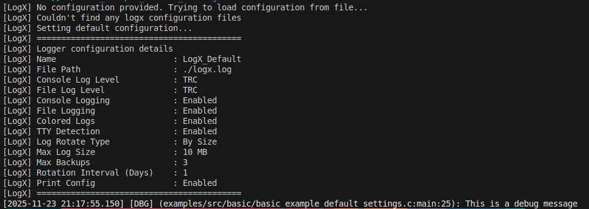

---

### LogX Integration - Overriding Default Configuration

- LogX provides flexibility to override the default logger configurations defined in `logx_config.h`.

```c
#define LOGX_DEFAULT_CFG_NAME                       "LogX_Default"
#define LOGX_DEFAULT_CFG_LOGFILE_PATH               "./logx.log"
#define LOGX_DEFAULT_CFG_CONSOLE_LEVEL              LOGX_LEVEL_TRACE
#define LOGX_DEFAULT_CFG_FILE_LEVEL                 LOGX_LEVEL_TRACE
#define LOGX_DEFAULT_CFG_ENABLE_CONSOLE_LOGGING     1
#define LOGX_DEFAULT_CFG_ENABLE_FILE_LOGGING        1
#define LOGX_DEFAULT_CFG_ENABLE_COLORED_LOGGING     1
#define LOGX_DEFAULT_CFG_ENABLE_TTY_DETECTION       1
#define LOGX_DEFAULT_CFG_LOG_ROTATE_TYPE            LOGX_ROTATE_BY_SIZE
#define LOGX_DEFAULT_CFG_MAX_LOGFILE_SIZE_MB        10
#define LOGX_DEFAULT_CFG_MAX_LOGFILE_BACKUPS        3
#define LOGX_DEFAULT_CFG_LOG_ROTATE_AFTER_DAYS      1
#define LOGX_DEFAULT_CFG_BANNER_PATTERN             "="
#define LOGX_DEFAULT_CFG_PRINT_CONFIG               1
#define LOGX_DEFAULT_CFG_TIMESTAMP_FORMAT           LOGX_TS_FMT_LOCAL
```

- All the above macros are guarded with `#ifndef` which allows you to override them from your project code.
- Simply define the macro you want to change **before** `#include <logx.h>`.

---

### LogX Integration - Passing configuration

```c
#include <logx.h>
#include <stdio.h>

int main()
{
    logx_t    *logger = NULL;
    logx_cfg_t cfg    = {0};

    /* Logger Configuration */
    cfg.name                   = "LogX";
    cfg.enable_console_logging = 1;
    cfg.enable_file_logging    = 1;
    cfg.file_path              = "./basic_example_passing_configuration.log";
    cfg.enable_colored_logs    = 1;
    cfg.use_tty_detection      = 1;
    cfg.console_level          = LOGX_LEVEL_TRACE;
    cfg.file_level             = LOGX_LEVEL_TRACE;
    cfg.rotate.type            = LOGX_ROTATE_BY_SIZE;
    cfg.rotate.size_mb         = 1;     /* 1 MB */
    cfg.rotate.max_backups     = 3;
    cfg.print_config           = 1;
    cfg.ts_format              = LOGX_TS_FMT_LOCAL;

    if (logx_create(&cfg, &logger) != LOGX_ERR_SUCCESS)
    {
        fprintf(stderr, "Failed to create logger instance\n");
        return -1;
    }

    LOGX_BANNER(logger, "Welcome to LogX Logging");
    logx_destroy(logger);
    return 0;
}
```

### Output:

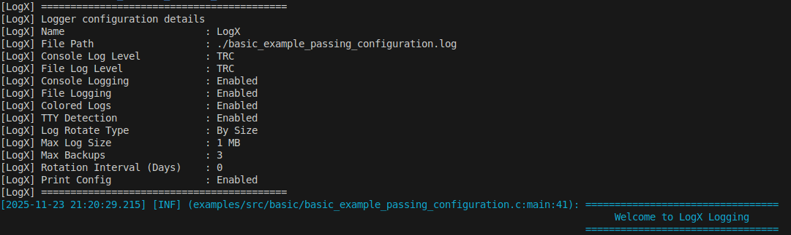

---

### LogX Integration - Parsing configuration from default file

- When `logx_create()` is called with `NULL`, LogX will try to look for configuration information in the following order until success:
    1. If `LOGX_CFG_FILEPATH` macro is defined, tries to fetch information from that file.
    2. Looks for `./logx_cfg.yml`, `./logx_cfg.yaml` or `./logx_cfg.json` (in the same order).
    3. Falls back to built-in default configuration.

```c
#include <logx.h>
#include <stdio.h>

int main()
{
    logx_t *logger = NULL;

    if (logx_create(NULL, &logger) != LOGX_ERR_SUCCESS)
    {
        fprintf(stderr, "Failed to create logger instance\n");
        return -1;
    }

    LOGX_BANNER(logger, "Welcome to LogX Logging");
    logx_destroy(logger);
    return 0;
}
```

### Output:

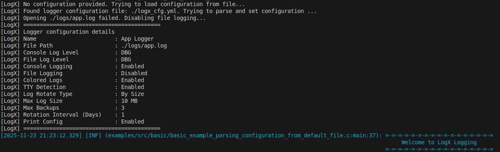

---

### LogX Integration - Parsing configuration from custom file

- Define `LOGX_CFG_FILEPATH` before including `<logx.h>` to point LogX at your own configuration file (must be a valid YAML or JSON file).

```c
#include <stdio.h>

#define LOGX_CFG_FILEPATH "./my_logx_config.yml"

#include <logx.h>

int main()
{
    logx_t *logger = NULL;

    if (logx_create(NULL, &logger) != LOGX_ERR_SUCCESS)
    {
        fprintf(stderr, "Failed to create logger instance\n");
        return -1;
    }

    LOGX_BANNER(logger, "Welcome to LogX Logging");
    logx_destroy(logger);
    return 0;
}
```

---

## LogX - Log Levels

- LogX provides the following log levels:
    - `TRACE` - Useful when debugging the flow of the program
    - `DEBUG` - Useful for logging information that is for developers only
    - `INFO` - Useful for logging information necessary for non-developers, perhaps during testing
    - `WARN` - Useful for logging failures that do not affect functionality, but still need attention
    - `ERROR` - Useful for logging errors
    - `FATAL` - Useful for logging critical failures after which the program needs to terminate
    - `BANNER` - Useful for logging specific milestones during runtime (e.g. "Starting firmware update...")

```c
typedef enum
{
    LOGX_LEVEL_TRACE = 0,
    LOGX_LEVEL_DEBUG,
    LOGX_LEVEL_BANNER,
    LOGX_LEVEL_INFO,
    LOGX_LEVEL_WARN,
    LOGX_LEVEL_ERROR,
    LOGX_LEVEL_FATAL,
    LOGX_LEVEL_OFF
} logx_level_t;
```

### LogX - Trace

```c
LOGX_TRACE(logger, "This is a trace message and BLUE in color");
```

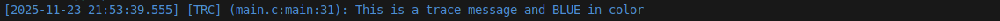

### LogX - Debug

```c
LOGX_DEBUG(logger, "This is a debug message and WHITE in color");
```

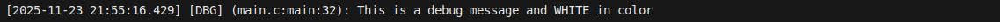

### LogX - Info

```c
LOGX_INFO(logger, "This is an info message and GREEN in color");
```

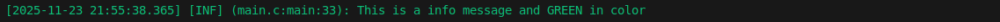

### LogX - Warn

```c
LOGX_WARN(logger, "This is a warn message and YELLOW in color");
```

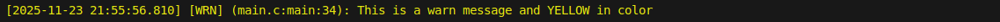

### LogX - Error

```c
LOGX_ERROR(logger, "This is an error message and RED in color");
```

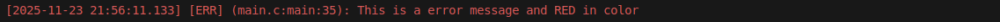

### LogX - Fatal

```c
LOGX_FATAL(logger, "This is a fatal message and MAGENTA in color");
```

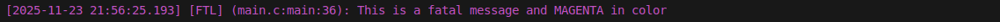

### LogX - Banner

```c
LOGX_BANNER(logger, "This is a banner message and CYAN in color");
```

- If you notice, there is one thing specially crafted about `LOGX_BANNER`, can you guess what it is 👀 ?

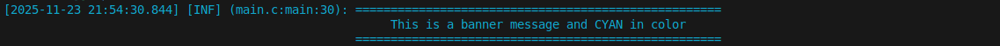

- Banner messages are **auto-centered** inside the banner, making it look aesthetically more beautiful ✨

---

## LogX - Log Rate Limiting

- In high-frequency code paths (e.g. sensor polling loops), you may want to log a message at most once every N seconds to avoid flooding the log.
- LogX provides rate-limited variants for every log level using the `LOGX_*_FREQ` macros.

**Syntax:**
```c
LOGX_<LEVEL>_FREQ(logger, seconds, fmt, ...)
```

**Example — log a status message at most once every 5 seconds:**

```c
#include <logx.h>
#include <stdio.h>
#include <unistd.h>

int main()
{
    logx_t *logger = NULL;

    if (logx_create(NULL, &logger) != LOGX_ERR_SUCCESS)
    {
        fprintf(stderr, "Failed to create logger instance\n");
        return -1;
    }

    while (1)
    {
        /* This line executes every second, but only logs every 5 seconds */
        LOGX_INFO_FREQ(logger, 5, "Status: system running normally");
        sleep(1);
    }

    logx_destroy(logger);
    return 0;
}
```

**Available rate-limited macros:**

| Macro | Description |
|-------|-------------|
| `LOGX_TRACE_FREQ(logger, sec, fmt, ...)` | Rate-limited TRACE |
| `LOGX_DEBUG_FREQ(logger, sec, fmt, ...)` | Rate-limited DEBUG |
| `LOGX_INFO_FREQ(logger, sec, fmt, ...)`  | Rate-limited INFO  |
| `LOGX_WARN_FREQ(logger, sec, fmt, ...)`  | Rate-limited WARN  |
| `LOGX_ERROR_FREQ(logger, sec, fmt, ...)` | Rate-limited ERROR |
| `LOGX_FATAL_FREQ(logger, sec, fmt, ...)` | Rate-limited FATAL |
| `LOGX_BANNER_FREQ(logger, sec, fmt, ...)` | Rate-limited BANNER |

- Each macro site maintains its own independent timer, so two `LOGX_INFO_FREQ` calls at different places in the code each have their own N-second window.

---

## LogX - Log Rotation

- LogX comes with log rotation built in, so you don't need to worry about log files filling up disk space.
- LogX lets you control rotation based on `SIZE` or `DATE`. See [Setting log rotate type](#logx-api---setting-log-rotate-type).
- LogX also lets you control the number of backups to keep. See [Setting number of logfile backups](#logx-api---setting-number-of-logfile-backups).

```c
typedef struct
{
    logx_rotate_type_t type;        /* type of rotation */
    size_t             size_mb;     /* used when type == LOGX_ROTATE_BY_SIZE */
    int                max_backups; /* number of backup files to keep (0 = truncate, no backups) */
    int                after_days;  /* days between rotations when type == LOGX_ROTATE_BY_DATE */
} logx_rotate_cfg_t;
```

**Log Rotation Types:**

```c
typedef enum
{
    LOGX_ROTATE_NONE = 0,
    LOGX_ROTATE_BY_SIZE,
    LOGX_ROTATE_BY_DATE
} logx_rotate_type_t;
```

---

### LogX - Rotation based on size

- Use `cfg.rotate.type = LOGX_ROTATE_BY_SIZE` and specify the max file size in MB via `cfg.rotate.size_mb`.

```c
cfg.rotate.type        = LOGX_ROTATE_BY_SIZE;
cfg.rotate.size_mb     = 10;    /* Rotate when log file exceeds 10 MB */
cfg.rotate.max_backups = 5;     /* Keep up to 5 backup files */
```

- For example, given log path `example.log`:
  - On first rotation: `example.log` → `example.log.1`, new `example.log` created.
  - On second rotation: `example.log.1` → `example.log.2`, `example.log` → `example.log.1`.
  - Once `cfg.rotate.max_backups` files exist, the oldest backup is deleted on the next rotation.

---

### LogX - Rotation based on date

- On `logx_create`, LogX saves the current date. Each log call checks if the date has changed by `cfg.rotate.after_days` and triggers rotation if so.

```c
cfg.rotate.type        = LOGX_ROTATE_BY_DATE;
cfg.rotate.after_days  = 1;     /* Rotate daily */
cfg.rotate.max_backups = 5;     /* Keep 5 daily backups */
```

---

### LogX - No rotation

- Set `cfg.rotate.type = LOGX_ROTATE_NONE` to disable automatic rotation entirely.

---

## LogX - Timers

### Simple Timer

```c
/* Start the timer */
logx_timer_start(logger, "my_timer");

/* ... do some work ... */
sleep(1);

/* Stop the timer — elapsed time is logged automatically */
logx_timer_stop(logger, "my_timer");
```

---

### Pause & Resume

```c
logx_timer_start(logger, "pause_resume_timer");

sleep(1);                                       /* 1s elapsed */

logx_timer_pause(logger, "pause_resume_timer"); /* timer paused */

sleep(2);                                       /* 2s pass, not counted */

logx_timer_resume(logger, "pause_resume_timer");/* timer resumes */

sleep(1);                                       /* 1s elapsed */

logx_timer_stop(logger, "pause_resume_timer");  /* total: ~2s */
```

---

### Auto Scope timer

- `LOGX_TIMER_AUTO` automatically stops the timer whenever the enclosing function returns, regardless of which return path is taken.

```c
void auto_timer(logx_t *logger, int wait_time)
{
    LOGX_TIMER_AUTO(logger, "auto timer");

    switch (wait_time)
    {
        case 1:  sleep(1); return;
        case 2:  sleep(2); return;
        case 3:  sleep(3); return;
        default: sleep(1); return;
    }
}

int main()
{
    logx_t *logger = NULL;
    logx_create(NULL, &logger);

    auto_timer(logger, 1);

    logx_destroy(logger);
    return 0;
}
```

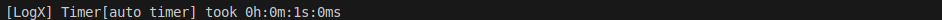

---

## LogX - Configuration APIs

Users can call the following APIs from their project code at runtime to modify the behavior of LogX instances.

### LogX API - Create

- Creates and initializes a logger instance.
- Pass a pointer to a `logx_cfg_t` struct to provide custom configuration, or `NULL` to use automatic configuration loading.
- The logger is returned via the output parameter `out_logger`.
- **LogX will automatically create any intermediate directories** needed for the log file path.

```c
logx_t *logger = NULL;

if (logx_create(NULL, &logger) != LOGX_ERR_SUCCESS)
{
    fprintf(stderr, "LogX instance creation failed\n");
    return -1;
}
```

---

### LogX API - Destroy

- Call this before exiting your application. It flushes and closes the log file, and frees all memory.
- Returns `LOGX_ERR_SUCCESS` on success, or `LOGX_ERR_INVALID_ARG` if `logger` is NULL.

```c
logx_destroy(logger);
```

---

### LogX API - Enabling/Disabling console logging

```c
logx_enable_console_logging(logger);
logx_disable_console_logging(logger);
```

---

### LogX API - Setting console log level

```c
/* Only WARN and above will be printed to the console */
logx_set_console_logging_level(logger, LOGX_LEVEL_WARN);
```

---

### LogX API - Enabling/Disabling file logging

```c
logx_enable_file_logging(logger);
logx_disable_file_logging(logger);
```

---

### LogX API - Setting file log level

```c
/* Only WARN and above will be written to the log file */
logx_set_file_logging_level(logger, LOGX_LEVEL_WARN);
```

---

### LogX API - Enabling/Disabling colored logging

- *NOTE*: Colors are automatically disabled when TTY detection is enabled and stdout is not a terminal.

```c
logx_enable_colored_logging(logger);
logx_disable_colored_logging(logger);
```

---

### LogX API - Enabling/Disabling TTY detection

```c
logx_enable_tty_detection(logger);
logx_disable_tty_detection(logger);
```

---

### LogX API - Setting log rotate type

```c
logx_set_log_rotate_type(logger, LOGX_ROTATE_BY_SIZE);
logx_set_log_rotate_type(logger, LOGX_ROTATE_BY_DATE);
logx_set_log_rotate_type(logger, LOGX_ROTATE_NONE);
```

---

### LogX API - Forcing a log rotation

- Triggers a log rotation immediately, regardless of whether the size or date threshold has been reached.

```c
logx_rotate_now(logger);
```

---

### LogX API - Setting Max Size of Log files

- Sets the maximum log file size in MB. Rotation is triggered when this limit is reached and rotation type is `LOGX_ROTATE_BY_SIZE`.

```c
logx_set_log_file_size_mb(logger, 15); /* Rotate at 15 MB */
```

---

### LogX API - Setting Rotation Interval in Days

- Sets the number of days between rotations. Only used when rotation type is `LOGX_ROTATE_BY_DATE`.

```c
logx_set_rotation_after_days(logger, 7); /* Rotate weekly */
```

---

### LogX API - Setting number of logfile backups

- Sets how many backup files to keep during rotation.

- *NOTE*:
    - If `max_backups = 0`, the main log file is simply truncated on rotation — no backup is created.
    - Reducing `max_backups` does **not** immediately delete existing backup files above the new limit; they are cleaned up on subsequent rotations.

```c
logx_set_num_of_logfile_backups(logger, 5);
```

---

### LogX API - Enabling/Disabling print config

- Controls whether the active LogX configuration is printed to the console when `logx_create` is called.

```c
logx_enable_print_config(logger);
logx_disable_print_config(logger);
```

---

### LogX API - Setting timestamp format

- LogX supports several timestamp formats. The format can be set at configuration time via `cfg.ts_format`, or changed at runtime via the following APIs.

**Available formats:**

| Format constant | Example output |
|---|---|
| `LOGX_TS_FMT_LOCAL` | `2026-05-16 14:32:01.123` |
| `LOGX_TS_FMT_UTC` | `2026-05-16 08:32:01.123Z` |
| `LOGX_TS_FMT_EPOCH_S` | `1747384321` |
| `LOGX_TS_FMT_EPOCH_MS` | `1747384321123` |
| `LOGX_TS_FMT_EPOCH_US` | `1747384321123456` |
| `LOGX_TS_FMT_ISO8601` | `2026-05-16T08:32:01.123Z` |
| `LOGX_TS_FMT_RFC2822` | `Sat, 16 May 2026 08:32:01 +0000` |

**At configuration time:**

```c
logx_cfg_t cfg = {0};
cfg.ts_format  = LOGX_TS_FMT_ISO8601;
logx_create(&cfg, &logger);
```

**At runtime:**

```c
logx_set_ts_format_to_local(logger);
logx_set_ts_format_to_utc(logger);
logx_set_ts_format_to_epoch_s(logger);
logx_set_ts_format_to_epoch_ms(logger);
logx_set_ts_format_to_epoch_us(logger);
logx_set_ts_format_to_iso8601(logger);
logx_set_ts_format_to_rfc2822(logger);
```

**Full example:**

```c
#include <logx.h>
#include <stdio.h>

int main()
{
    logx_t *logger = NULL;

    if (logx_create(NULL, &logger) != LOGX_ERR_SUCCESS)
    {
        fprintf(stderr, "Failed to create logger instance\n");
        return -1;
    }

    logx_set_ts_format_to_local(logger);
    LOGX_DEBUG(logger, "Local time format");

    logx_set_ts_format_to_utc(logger);
    LOGX_DEBUG(logger, "UTC format");

    logx_set_ts_format_to_epoch_s(logger);
    LOGX_DEBUG(logger, "Unix seconds");

    logx_set_ts_format_to_epoch_ms(logger);
    LOGX_DEBUG(logger, "Unix milliseconds");

    logx_set_ts_format_to_epoch_us(logger);
    LOGX_DEBUG(logger, "Unix microseconds");

    logx_set_ts_format_to_iso8601(logger);
    LOGX_DEBUG(logger, "ISO 8601 format");

    logx_set_ts_format_to_rfc2822(logger);
    LOGX_DEBUG(logger, "RFC 2822 format");

    logx_destroy(logger);
    return 0;
}
```

---

## LogX - Utility APIs

### LogX - Binary String

- Ever been in a situation where you wanted to look at the individual bits of a value but felt too lazy to write a separate function for it? LogX provides the `LOGX_BIN_STR(val)` macro.

```c
LOGX_DEBUG(logger, "Binary representation of %d  is %s", 10,          LOGX_BIN_STR(10));
LOGX_DEBUG(logger, "Binary representation of %u  is %s", 255u,         LOGX_BIN_STR(255u));
LOGX_DEBUG(logger, "Binary representation of %d  is %s", -128,         LOGX_BIN_STR(-128));
LOGX_DEBUG(logger, "Binary representation of %u  is %s", 65535u,       LOGX_BIN_STR(65535u));
LOGX_DEBUG(logger, "Binary representation of %d  is %s", -32768,       LOGX_BIN_STR(-32768));
LOGX_DEBUG(logger, "Binary representation of %u  is %s", 4294967295u,  LOGX_BIN_STR(4294967295u));
LOGX_DEBUG(logger, "Binary representation of %d  is %s", -2147483648,  LOGX_BIN_STR(-2147483648));
```

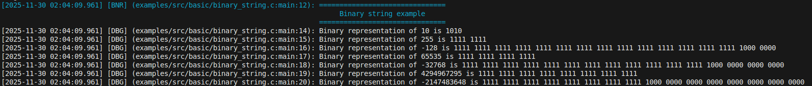

- Output is grouped into nibbles (4-bit groups) for easier reading 👀

---
